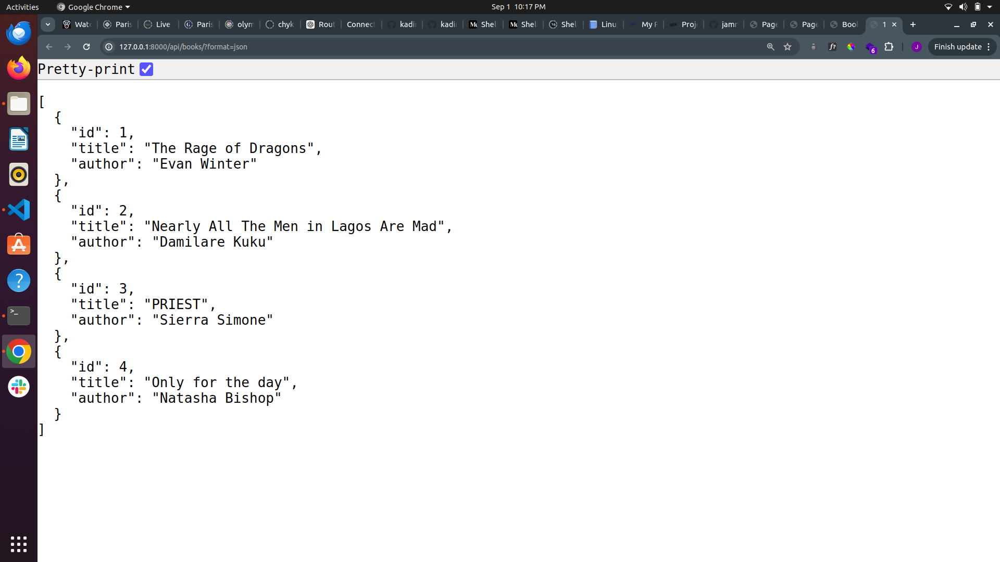

# GET
Using curl
```
curl -X GET 'http://127.0.0.1:8000/api/books/' or curl -X GET http://127.0.0.1:8000/api/books/1/

```

# POST
Using curl
```
curl -X POST 'http://127.0.0.1:8000/api/books/ -H "Content-Type: application/json' -d '{ title: "New Book Title", author: "Author Name"}'
```
# PUT
Using curl
```
curl -X PUT 'http://127.0.0.1:8000/api/books/1/ -H "Content-Type: application/json' -d '{ title: "Updated Book Title", author: "Updated Author Name"}'
```

# DELETE
Using curl
```
curl -X DELETE 'http://127.0.0.1:8000/api/books/3/ -H "Content-Type: application/json' -d '{ title: "New Book Title", author: "Author Name"}'
```

# SCREENSHOT
